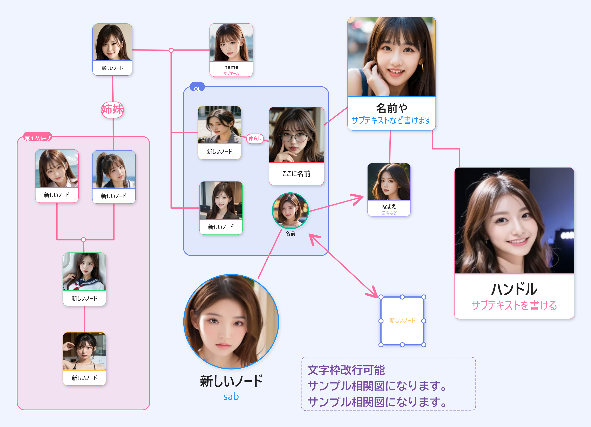

# RelationGraph（相関図メーカー）

ドラマや小説・ゲームの人物相関図を手軽に作れる、Windows用デスクトップアプリです。

## 主な機能

- 人物ノードに写真を設定（トリミング機能付き）
- カード型・コンパクト・シンプル枠・丸型の4スタイル
- 実線・破線・点線・二重線・矢印など豊富な線種
- ラベル付きの接続線、1対多のフォーク接続
- グループ枠でキャラクターをまとめて表示
- フリーテキストボックス配置
- 名前・サブテキストの文字色・サイズを自由に設定
- PNG・SVG形式で書き出し（高解像度）
- .rgファイルで保存・読み込み
- 日本語・英語・韓国語・中国語（簡体・繁体）・スペイン語 対応

## 動作環境

- Windows 10 / 11（64bit）

## インストール

1. [Releases](../../releases) から `RelationGraph Setup 1.0.0.exe` をダウンロード
2. インストーラーを実行
3. スタートメニューまたはデスクトップのショートカットから起動

> ⚠️ コード署名なしのため、初回起動時にWindowsスマートスクリーンの警告が出ることがあります。「詳細情報」→「実行」で起動できます。

## 使い方

1. 「ノード」ボタンでキャラクターを追加
2. ノードにホバーして接続ボタンで線を引く
3. 画像をドラッグ＆ドロップで写真を設定
4. PNG・SVGで書き出し

## 今後の予定

- 家系図作成アプリを別途リリース予定

## Support

気に入っていただけたら支援いただけると励みになります。

## ライセンス

本ソフトウェアは個人・商用問わず自由にご利用いただけます。
